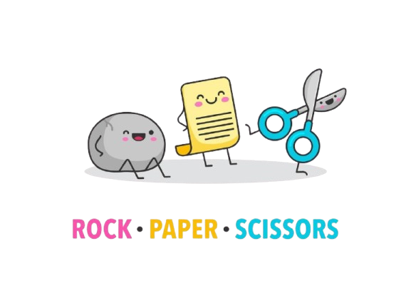

<!-- Improved compatibility of back to top link: See: https://github.com/othneildrew/Best-README-Template/pull/73 -->

<a id="readme-top"></a>

<!--
*** Thanks for checking out the Best-README-Template. If you have a suggestion
*** that would make this better, please fork the repo and create a pull request
*** or simply open an issue with the tag "enhancement".
*** Don't forget to give the project a star!
*** Thanks again! Now go create something AMAZING! :D
-->

<!-- PROJECT SHIELDS -->
<!--
*** I'm using markdown "reference style" links for readability.
*** Reference links are enclosed in brackets [ ] instead of parentheses ( ).
*** See the bottom of this document for the declaration of the reference variables
*** for contributors-url, forks-url, etc. This is an optional, concise syntax you may use.
*** https://www.markdownguide.org/basic-syntax/#reference-style-links
-->

[![Contributors][contributors-shield]][contributors-url]
[![Forks][forks-shield]][forks-url]
[![Stargazers][stars-shield]][stars-url]
[![Issues][issues-shield]][issues-url]
[![project_license][license-shield]][license-url]
[![LinkedIn][linkedin-shield]][linkedin-url]

<!-- PROJECT LOGO -->
<br />
<div align="center">
  <a href="https://github.com/ayemteezy/odin-rock-paper-scrissors">
    
  </a>

<h3 align="center">Odin Rock Paper Scissors (Console Edition)</h3>

  <p align="center">
    A robust, interactive command-line Rock Paper Scissors game built as part of The Odin Project curriculum.
    <br />
    <a href="https://github.com/ayemteezy/odin-rock-paper-scrissors"><strong>Explore the docs »</strong></a>
    <br />
    <br />
    <a href="https://ayemteezy.github.io/odin-rock-paper-scrissors/">View Demo</a>
    &middot;
    <a href="https://github.com/ayemteezy/odin-rock-paper-scrissors/issues/new?labels=bug&template=bug-report---.md">Report Bug</a>
    &middot;
    <a href="https://github.com/ayemteezy/odin-rock-paper-scrissors/issues/new?labels=enhancement&template=feature-request---.md">Request Feature</a>
  </p>
</div>

<!-- TABLE OF CONTENTS -->
<details>
  <summary>Table of Contents</summary>
  <ol>
    <li>
      <a href="#about-the-project">About The Project</a>
      <ul>
        <li><a href="#built-with">Built With</a></li>
      </ul>
    </li>
    <li>
      <a href="#getting-started">Getting Started</a>
      <ul>
        <li><a href="#prerequisites">Prerequisites</a></li>
        <li><a href="#installation">Installation</a></li>
      </ul>
    </li>
    <li><a href="#features">Features</a></li>
    <li><a href="#roadmap">Roadmap</a></li>
    <li><a href="#contributing">Contributing</a></li>
    <li><a href="#license">License</a></li>
    <li><a href="#contact">Contact</a></li>
    <li><a href="#acknowledgments">Acknowledgments</a></li>
  </ol>
</details>

<!-- ABOUT THE PROJECT -->

## About The Project

[![Product Name Screen Shot][product-screenshot]](https://ayemteezy.github.io/odin-rock-paper-scrissors/)

This project is a browser console-based execution of the classic game Rock, Paper, Scissors. It features a complete 5-round tournament engine against an automated computer player, tracking live scores and establishing an ultimate victor at the conclusion of the match.

Key behavioral implementations include:

- Case-insensitive input parsing ("rock", "ROCK", "RoCk" are all accepted).
- Input validation mechanisms catching user typos with graceful reprompt traps.
- Fail-safe handlers ensuring the script cleanly aborts if a player selects "Cancel".

<p align="right">(<a href="#readme-top">back to top</a>)</p>

### Built With

- [![HTML5][HTML.com]][HTML-url]
- [![JavaScript][JavaScript.com]][JavaScript-url]

<p align="right">(<a href="#readme-top">back to top</a>)</p>

<!-- GETTING STARTED -->

## Getting Started

To view and play the game locally, follow these simple setup steps.

### Prerequisites

You only need a modern web browser (Google Chrome, Mozilla Firefox, Microsoft Edge, Safari, etc.) to run this application.

### Installation

1. Clone the repository:
   ```sh
   git clone https://github.com/ayemteezy/odin-rock-paper-scrissors.git
   ```
2. Navigate to the project directory:
   ```sh
   cd odin-rock-paper-scrissors
   ```
3. Open `index.html` in your web browser.
4. Open your browser's Developer Tools Console to play:
   - Press `F12` or `Ctrl + Shift + I` (Windows/Linux)
   - Press `Cmd + Option + I` (macOS)

<p align="right">(<a href="#readme-top">back to top</a>)</p>

<!-- FEATURES EXAMPLES -->

## Features

- **Error-Proof Traps**: Entering inputs like "spaghetti" will log a validation error and keep the user inside a safe looping prompt until a valid string is given.
- **State Preservation**: Scores are isolated locally within execution scopes to prevent global variable leaks.
- **Informative Logs**: The console acts as the interface, outputting real-time data logs, score summaries, and match outcomes.

<p align="right">(<a href="#readme-top">back to top</a>)</p>

<!-- ROADMAP -->

## Roadmap

- [x] Functional pseudocode architecture mapping
- [x] Input normalization loops (Case insensitivity)
- [x] Crash-preventative handling for user cancellations
- [ ] Transition game logic from Console to Graphic User Interface (GUI)
- [ ] Add visual choice tracking buttons using the DOM API

See the [open issues](https://github.com/ayemteezy/odin-rock-paper-scrissors/issues) for a full list of proposed features (and known issues).

<p align="right">(<a href="#readme-top">back to top</a>)</p>

<!-- CONTRIBUTING -->

## Contributing

Contributions are what make the open source community such an amazing place to learn, inspire, and create. Any contributions you make are **greatly appreciated**.

If you have a suggestion that would make this better, please fork the repo and create a pull request. You can also simply open an issue with the tag "enhancement".
Don't forget to give the project a star! Thanks again!

1. Fork the Project
2. Create your Feature Branch (`git checkout -b feature/AmazingFeature`)
3. Commit your Changes (`git commit -m 'Add some AmazingFeature'`)
4. Push to the Branch (`git push origin feature/AmazingFeature`)
5. Open a Pull Request

<p align="right">(<a href="#readme-top">back to top</a>)</p>

### Top contributors:

<a href="https://github.com/ayemteezy/odin-rock-paper-scrissors/graphs/contributors">
  
</a>

<!-- LICENSE -->

## License

Distributed under the MIT License. See `LICENSE` for more information.

<p align="right">(<a href="#readme-top">back to top</a>)</p>

<!-- CONTACT -->

## Contact

Laurence Lester Cariño (Teezy) - [@ayemteezy\_](https://x.com/ayemteezy_) - laurencelestercarino@gmail.com

Project Link: [https://github.com/ayemteezy/odin-rock-paper-scrissors](https://github.com/ayemteezy/odin-rock-paper-scrissors)

<p align="right">(<a href="#readme-top">back to top</a>)</p>

<!-- ACKNOWLEDGMENTS -->

## Acknowledgments

- [The Odin Project Foundations Curriculum](https://theodinproject.com)
- [MDN Web Docs - Math.random()](https://developer.mozilla.org/en-US/docs/Web/JavaScript/Reference/Global_Objects/Math/random)

<p align="right">(<a href="#readme-top">back to top</a>)</p>

<!-- MARKDOWN LINKS & IMAGES -->
<!-- https://www.markdownguide.org/basic-syntax/#reference-style-links -->

[contributors-shield]: https://img.shields.io/github/contributors/ayemteezy/odin-rock-paper-scrissors.svg?style=for-the-badge
[contributors-url]: https://github.com/ayemteezy/odin-rock-paper-scrissors/graphs/contributors
[forks-shield]: https://img.shields.io/github/forks/ayemteezy/odin-rock-paper-scrissors.svg?style=for-the-badge
[forks-url]: https://github.com/ayemteezy/odin-rock-paper-scrissors/network/members
[stars-shield]: https://img.shields.io/github/stars/ayemteezy/odin-rock-paper-scrissors.svg?style=for-the-badge
[stars-url]: https://github.com/ayemteezy/odin-rock-paper-scrissors/stargazers
[issues-shield]: https://img.shields.io/github/issues/ayemteezy/odin-rock-paper-scrissors.svg?style=for-the-badge
[issues-url]: https://github.com/ayemteezy/odin-rock-paper-scrissors/issues
[license-shield]: https://img.shields.io/github/license/ayemteezy/odin-rock-paper-scrissors.svg?style=for-the-badge
[license-url]: https://github.com/ayemteezy/odin-rock-paper-scrissors/blob/master/LICENSE.txt
[linkedin-shield]: https://img.shields.io/badge/-LinkedIn-black.svg?style=for-the-badge&logo=linkedin&colorB=555
[linkedin-url]: https://www.linkedin.com/in/laurence-lester-cari%C3%B1o/
[product-screenshot]: images/screenshot.jpg

<!-- Shields.io badges. You can a comprehensive list with many more badges at: https://github.com/inttter/md-badges -->

[HTML.com]: https://img.shields.io/badge/HTML5-E34F26?style=for-the-badge&logo=html5&logoColor=white
[HTML-url]: https://developer.mozilla.org/en-US/docs/Web/HTML
[JavaScript.com]: https://img.shields.io/badge/JavaScript-%23F7DF1E?style=for-the-badge&logo=javascript&logoColor=000
[JavaScript-url]: https://developer.mozilla.org/en-US/docs/Web/JavaScript
